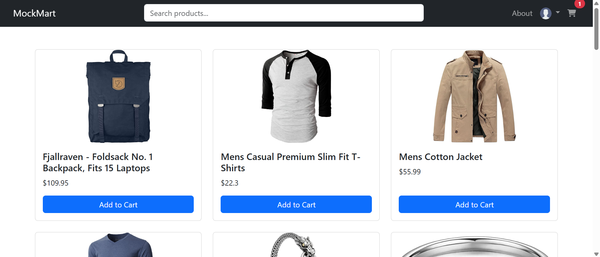
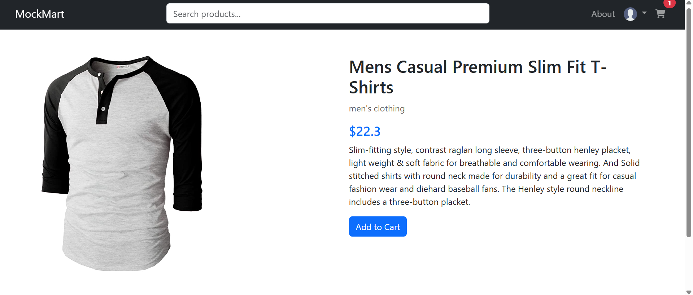

# 🛒 MockMart - E-Commerce Website

MockMart is a responsive e-commerce website built using **HTML**, **CSS**, and **JavaScript**. It showcases dynamic product listings, a functional cart system using `localStorage`, user login/logout support, and a modular code structure with reusable navbar and footer.

---

## 🚀 Features

- 🔍 **Live Search** functionality
- 🛒 **Add to Cart** and **cart count** with `localStorage` persistence
- 👤 **Login/Logout** support with simulated user sessions
- 📦 **Product detail** navigation
- ⬆️ **Scroll to top** button for better UX
- 📱 Fully **responsive design** for mobile, tablet, and desktop
- 📚 Modular HTML structure: header (`navbar.html`) and footer (`footer.html`)
- ✨ Smooth UI transitions and hover effects

---

## 📸 Screenshots

| Home Page | Product Detail | Cart |
|-----------|----------------|------|
|  |  |  |

---

## 🛠️ Tech Stack

- **HTML5**
- **CSS3** (Bootstrap 5 for components)
- **JavaScript (ES6+)**
- **[Fake Store API](https://fakestoreapi.com/)** for dynamic product data

---

## 📁 Folder Structure

📦 ecommerce-site
┣ 📂 css/
┃ ┗ 📜 style.css
┣ 📂 js/
┃ ┣ 📜 auth.js
┃ ┗ 📜 cart.js
┃ ┗ 📜 main.js
┃ ┗ 📜 product.js
┣ 📜 index.html
┣ 📜 product.html
┣ 📜 cart.html
┣ 📜 login.html
┣ 📜 about.html
┣ 📜 navbar.html
┣ 📜 footer.html
┣ 📜 README.md


---

## 🔧 How to Run Locally

1. **Clone the Repository**
   ```bash
   git clone https://github.com/mrbilalashraf/ecommerce-site.git
   cd ecommerce-site

1. **Open index.html in Browser**
    No server or build tool needed. This is a static frontend project.

🌐 [View Live Site](https://mockmart.netlify.app/)

🔐 Authentication Note
The login system is client-side only (no backend), and data is stored in localStorage.

For demo purposes, users can login without real credentials.

🙋‍♂️ Author
Muhammad Bilal Ashraf
🛠 Full Stack Developer | 💡 Always learning
📍 Pakistan | 🌐 Passionate about building scalable web apps

📬 Feedback
If you find any bugs or have suggestions, feel free to open an issue or reach out via email.